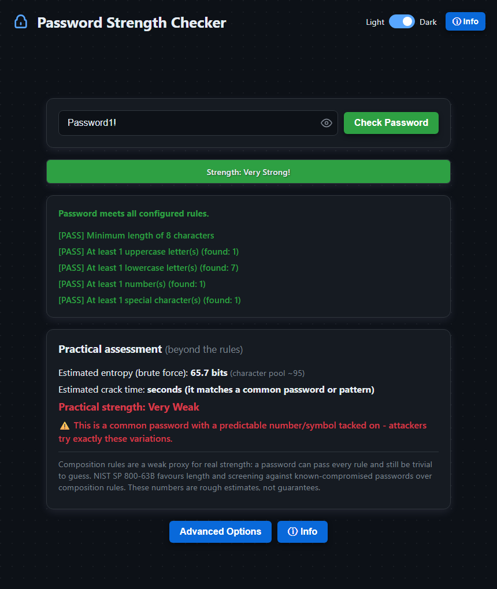

# Password Strength Checker

[](https://github.com/JampaniKomal/Password-Strength-Checker/actions/workflows/ci.yml)

A privacy-focused, client-side web app that helps you build strong passwords.
It checks a password two ways — against configurable **composition rules** and
against a **practical reality check** (entropy plus a common-password / pattern
screen) — because passing the rules is not the same as being hard to guess.
Everything runs in your browser; nothing is ever sent or stored.

**Live Demo:** [jampanikomal.github.io/Password-Strength-Checker](https://jampanikomal.github.io/Password-Strength-Checker/)



## Why two views?

Composition rules ("at least one uppercase, one digit, one symbol, 8+ chars") are
easy to game. `Password1!` satisfies every common rule and looks "Very Strong" by
that measure — but it is a top-common word with a predictable suffix and would be
guessed almost instantly. [NIST SP 800-63B](https://pages.nist.gov/800-63-3/sp800-63b.html)
actually **recommends against** mandatory composition rules, favouring length and
screening passwords against lists of known-compromised values.

So this tool keeps the configurable composition rules (they are still useful, and
you can tune them), but adds a second panel that:

- estimates **entropy** from the character pool and length (a brute-force-only
  upper bound);
- screens for **common passwords** and common decorations of them (e.g.
  `password` → `Password1!`);
- flags obvious **patterns** — keyboard/alphabetical sequences, repeated runs,
  trailing years, numeric-only;
- gives a **practical verdict** that downgrades a password the rules would have
  passed, and shows an honest crack-time estimate (dictionary speed when a pattern
  is found, brute-force speed otherwise).

## Features

- **Configurable composition rules:** minimum length and minimum counts of
  uppercase, lowercase, digits and special characters. Set any value to **0** to
  disable that rule.
- **Practical assessment:** entropy estimate, common-password/pattern warnings,
  crack-time estimate and an overall practical rating.
- **Privacy-focused:** all analysis is local; nothing is transmitted or stored.
- **Animated per-rule results** and a 0–5 strength bar.
- **Show/hide** toggle, **light/dark theme**, responsive layout.

## How it works

All analysis lives in one dependency-free module, [`js/strength.js`](js/strength.js),
written so it runs unchanged in the browser (as the global `PasswordStrength`) and
under Node, which is what lets it be unit-tested. The UI wiring is in
[`js/app.js`](js/app.js).

```
index.html             # markup + CDN jQuery
style.css              # styling (light/dark themes)
js/strength.js         # analysis engine (browser + Node, no dependencies)
js/app.js              # UI wiring
tests/strength.test.js # automated tests (node --test)
.github/workflows/     # CI
docs/screenshot.png
```

## Running locally

No build or install — the only runtime dependency is jQuery from a CDN:

```sh
git clone https://github.com/JampaniKomal/Password-Strength-Checker.git
cd Password-Strength-Checker
python -m http.server     # then open http://localhost:8000
```

## Testing

The engine has an automated suite (15 tests) using Node's built-in runner — no
dependencies at all:

```sh
npm test      # or: node --test
```

It covers composition-rule evaluation (including the "0 disables a rule" behaviour
and the space-as-special-character quirk), the entropy estimate, the
common-password and pattern detection, crack-time scaling, and the end-to-end
check that a rule-passing common password is still rated weak. CI runs it on
Node 18, 20 and 22.

## Bug found and fixed

Writing the tests and driving the real app confirmed a bug that had been fixed
earlier and is now locked in by a regression test: the README documents
"set any value to 0 to disable a rule", and that worked for the four
character-type rules, but the **Minimum Length** Apply handler required a value
`>= 1`, so entering `0` was silently rejected and the length rule could never be
disabled. The validation now accepts `0`, and the input's `min` attribute matches.
(This pass also added the missing `</body></html>` the page had been shipping
without.)

## Security notes and limitations

- **It's a guidance tool, not a gate.** Type real passwords only into the live
  page or your own local copy; the point is to *learn* what makes a password weak.
- **The entropy number is a brute-force upper bound.** It assumes characters were
  chosen at random, which real passwords are not — that is exactly why the
  pattern/common-password screen exists and can override it.
- **The common-password list is small and illustrative.** A real deployment should
  screen against a full breached-password corpus (e.g. the Have I Been Pwned
  range API, which uses k-anonymity so the password is never sent in full). This
  app intentionally does no network calls.
- **The crack-time estimate is a rough illustration** at an assumed ~10¹⁰ guesses/s
  offline fast-hash rate, not a guarantee.
- For serious use, prefer a long passphrase or a password manager's generated
  password, and rely on a vetted estimator such as zxcvbn.

## License

Open source under the [MIT License](LICENSE).
